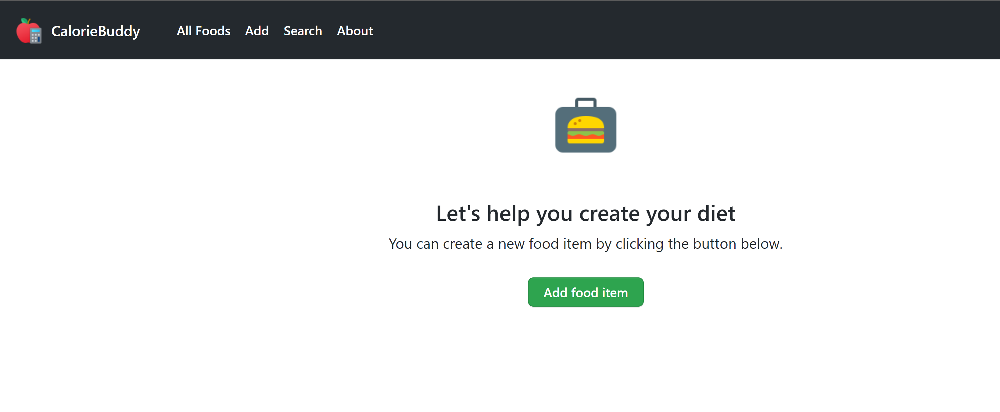
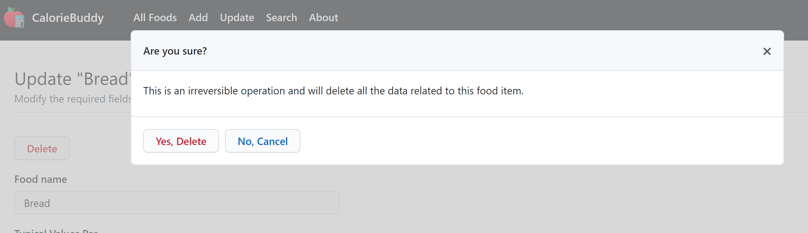
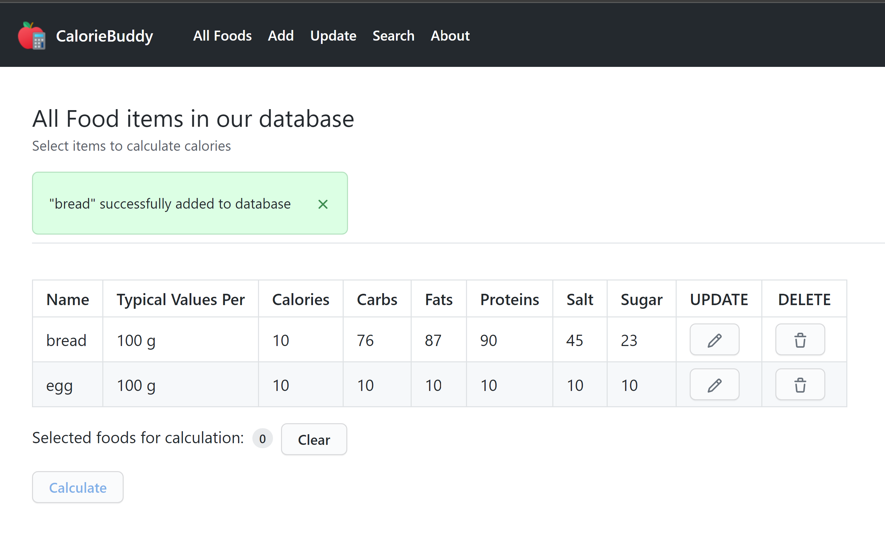
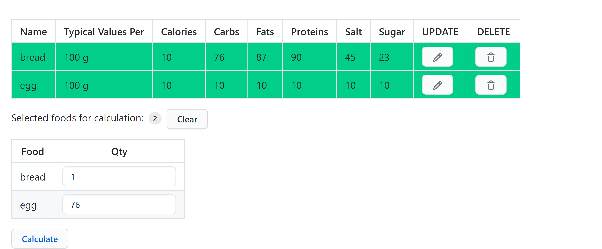
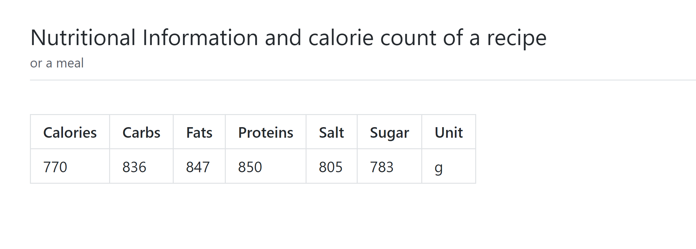

# DNW-midterm: Report

# Introduction

I started off by setting up the database by analysing the given requirements. I created the `foods` table and also inserted some sample data in order to test it. The SQL queries for creating the database and table schema can be found in the [Database Schema](#database-schema) section and also in the `setup.sql` file in the source code directory. I have used the open source [Primer CSS](https://primer.style/css/)[^1] framework by GitHub for styling my web pages and [VueJS](https://v3.vuejs.org/)[^2], an open source JavaScript framework to add interactivity to the food lists page. More information on how the requirements are satisfied is provided in the section that follows.

[^1]: 2020, Github Open Source, https://primer.style/css/
[^2]: 2020, Vuejs.org Open Source, https://v3.vuejs.org/

# Requirements

## R1: Home Page

I have added a home page that is rendered (`view/index.ejs`) when the user goes to the base route (i.e. '/'). This page contains two major parts:

1. A navigation bar containing the name of the application (`R1A`) and links to other pages (`R1B`). The markup for the navigation bar is placed in a separate template file (`view/header.ejs`) because it is used in every page. This reduces code repetition, since, we can use the `include` function to include this template code in any other template file like this:

```javascript
<%- include('header'); -%>
```

2. A [blankstate](https://primer.style/css/components/blankslate) prompting the user to start using the application by adding a new food to the database.




## R2: About Page

This page can be accessed by visiting the '`/about`' route. The `about.ejs` template gets rendered on recieving a `GET` request at this route.

 (`R2A`) This page shows a small summary of the web application's purpose, my name as a developer and the stack of technologies used (using some colorful span backgrounds). Also, there is a navigation bar with links to all other pages.

## R3: Add Food Page

This page contains a form with the following feilds to add a food item to the database:

* Food Name
* Typical Values Per
* Unit of Typical Values
* Calories
* Carbs
* Fats
* Protein
* Salt
* Sugar

There are two buttons: one to add the item to the database (`Add to Database`) and a second button (`clear`) to clear all the form feilds.

I have used a little DOM manipulation to implement the `clear` button:

```javascript
clearButton.addEventListener('click', () => {
    // Get all the input elements
    const inputs = document.getElementsByClassName("form-control");

    // Iterate through each input elements
    for (let input of inputs) {
        // Clear its value
        input.value = "";
    }
});
```

This page (rendered using the '`views/add_food.ejs`' template) can be accessed either by clicking the '`Add`' link in the navbar or by sending a `GET` request to the '`/add`' route. A navigation bar is present to let the user navigate the site easily. (R3A)

Once the user clicks the `Add to Database` button (or in other words, submits the form), the form data is sent to the server via a `POST` request to '`/add`' route.

On the server side, the data is accessed through the `request` object's body property and is converted into an array (in suitable order) for passing it to the `mysql` driver's `query` method. The conversion has been extracted into a function named `convertToArray` which takes `request.body` as paramter and returns a JavaScript Array containing values for different columns of the `foods` table. This function uses the `parseFloat` function of JavaScript to convert the string values into suitable format and it can be found at the top of the '`routes/main.js`' file.

Finally, the query method is called on the database object to `INSERT` a row in the database with the given values (R3B):

```javascript
const insert_statement = "INSERT INTO foods VALUES (?, ?, ?, ?, ?, ?, ?, ?, ?)";

// ...

// Query the database with data and statement
db.query(insert_statement, food_data, (err) => {
    // If an error occurs
    if (err) {
        // Set status to 500 (Internal Server Error)
        res.status(500).send("Something went wrong with the database.");
    }
    // No errors
    // Set flash message
    req.app.set(
        'message', 
        `"${food_data[0]}" successfully added to database`
    );
    // ...
}
```

If some error occurs while performing the insert operation, the status code of the response is set to `500` and a short message is sent to the client notifying them about the error. If there are no errors, then a 'message' is set on the app instance about the successful addition of the given food item to the database and the user is redirected to the lists page. The message is then retrieved on the list page's route handler and displayed to the user (R3C).

## R4: Search Food Page

This page displays a single form feild to enter the search query (food name). This page can be accessed either by going to the `'/search'` route (or equivalently sending a `GET` request to this endpoint) or by clicking `Search` from the navbar. (R4A)

When the user enters a search string and clicks on the search button, a `GET` request is sent to the server along with the search query string to the endpoint '`/search_db`'. 

On the server side, the query string is accessed using the `request.query`
object and a search is performed using the following SQL query:

```javascript
// SQL command to select all columns for rows 
// whose name column matches the given search keyword
const sql_command = "SELECT * FROM foods WHERE name REGEXP ?";
```

Since, we want to match any food name that contains the search string (partially or completely), I have used the `REGEXP` operator available on MySQL to perform a regular expression match on the `name` column. (R4C)

After fetching the results using the `mysql` driver, the results and the query string are passed to the render method along with the template name (template is `views/results.ejs` in this case), which renders the results:

```html
<!-- If there is at least one row -->
<% if(foods.length > 0) { %>
    <!-- Display a table containing the values -->
<% } else { %>
    <!-- If 0 results are found -->
    <!-- Display a message to the user -->
    <h1>No results found</h1>
<% } %>
```

If the length of the results list is greater than 0, a table containing the data for search results is displayed, otherwise a message (No results found) is displayed to the user. (R4B)

## R5: Update food page

Clicking on the `Update` button on the navbar or going to the '`/update`' route, renders a search form ('`views/update.ejs`'). The search keyword is sent to the server using `GET` method at '`/update_food`' endpoint. (R5A)

On the server side (at the '`/update_food`' endpoint), the query string is extracted and the user is redirected to '`/update/:name`' route to handle rendering of the update form for the food with the given search string. This route does the following:

1. Extracts the query param from the URL. (`:name`)

2. Executes a SQL query against the database to get the data for the food item with the given `name`.

3. If no food item is found, a message is set and the user is redirected to the lists page where the *message is displayed* (more details about this in [R6](#r6-list-foods-page)):

    ```javascript
    // If no food item was found with the given name
    if (foodItem.length == 0) {
        // Set a flash message
        req.app.set('message', `"${food_name}" not found!`);
        // redirect the user to list page
        return res.redirect("/foods");
    }
    ```

4. If a food item is found with the given name the '`views/update_food.ejs`' template is rendered with the data from the database. This template renders the exact from as the add food page but it is **pre-populated** with the data for the given food item.

The form gets submitted to `/update/:name` (where `:name` is the name of the food currently being updated) via a `POST` request.

On the server side, the SQL UPDATE command is used to **update the record associated with the given food item**. After the update operation is successfully completed, the user is redirected to the lists page and a *message is displayed about the completion of the operation*. (R5B)

On the update food item form page, there is also a `Delete` button which lets the user *delete a food item from the database*. As mentioned in the requirements (R5C), when the user clicks the button, a modal window is shown **asking for user confirmation** (VueJS is used to add conditional rendering of the modal window with some custom CSS styling). If the user proceeds with the deletion, a GET request is sent to the server at the end point '`/delete/:name`' where `:name` is the name of the food item to delete.
On the back-end, a SQL DELETE statement is executed and upon successful deletion, the user is redirected to the lists page with a *flash message*. (R5C)



## R6: List Foods Page

In my opinion, this is the most complex page with respect to the front end. I have used VueJS extensively in order to make it interactive.

This page can be accessed by clicking the `All Foods` or by going to the '`/foods`' route. This page displays all the food items in the database and all the data available for them, sorted by food name. (R6A)

As with other pages, this page also has a navbar for making
navigation easier. (R6B)

As seen in the previous requirements, the client is redirected to the lists page after a successfull operation from Create, Update or Delete. Hence, this route also handles the displaying of flash messages:



The flash message is removed, once it has been displayed:

```javascript
// Get any flash messages if any
const flashMessage = req.app.get('message');

// Remove any flash messages
req.app.set('message', null);
```

The user can also go to the update page for a particular food item by clicking the pencil icon or delete an item by clicking the trash can icon.

The users can click on a particular item to add it (click again to de-select) to the recipe calculation (maintained using VueJS data). Once the user selects a food item for calculation, a form field appears with the name of the selected item to enter the quantity of this particular food item in the recipe.

Once the user clicks the `Calculate` button, the selected food items along with the respective quantities are sent to the server for calculation.



The calculation is done at the '`/calculate`' route. After, the calculation has been done, the results of the calculation are rendered (`/views/report.ejs`) using the calculation data (R6C):



# Database Schema

## Creating of Database

I have given the name `food_db` to the database:

```sql
CREATE DATABASE food_db;
```

## Tables
For this project only one table was sufficient, which I have named `foods`. According to the given data to store in the database, I used the following following table definition:

```sql
CREATE TABLE IF NOT EXISTS foods(
	name VARCHAR(255) PRIMARY KEY,
    typical_values_per NUMERIC(6, 2)  DEFAULT 100,
    unit_of_tvp VARCHAR(100) DEFAULT "gram",
    calories NUMERIC(6, 2) DEFAULT 0,
    carbs NUMERIC(6, 2) DEFAULT 0,    
    fats NUMERIC(6, 2) DEFAULT 0,
	proteins NUMERIC(6, 2) DEFAULT 0,
    salt NUMERIC(6, 2) DEFAULT 0,
    sugar NUMERIC(6, 2) DEFAULT 0
);
```

The data types and feild names can be seen in the above SQL statement.
I choose `name` as the primary key because no two food items can have exactly the same name, otherwise, it would cause ambiguity for the user.

Also, I have provided default values for all the nutritional values, so that if they are not specified, they can be assumed to be 0. The default unit of typical values is "gram" and its default amount is 100.

# Summary

Overall, this project helped me to practice all of the concepts learned up till now in this module. The "Going beyond" requirements also tested and revised my knowledge learned in the `Web Development` module of Level 4.
